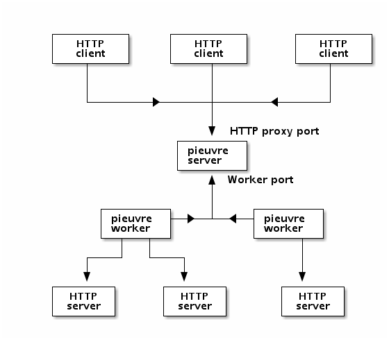

# Pieuvre: a distributed HTTP proxy

One Picture Is Worth One Thousand Words!

Pieuvre is made of two parts:

* a server, which acts as a HTTP proxy, and receives connections from workers;
* workers, which connect to the server, and issue HTTP requests on behalf of
  the clients.

## Usage

Start the server:

  node server.js

Start at least one worker:

  node worker.js

Configure your browser to use localhost:8081 as a proxy.

You can also go to http://localhost:8080/ to see an admin interface
(well, for now, don't expect too much: it just displays the list of workers).

## Deploy on dotCloud

Like this:

  git clone git://github.com/jpetazzo/pieuvre.git
  git push pieuvre pieuvre
  dotcloud info pieuvre.pieuvre

Your HTTP proxy is ready at the host:port shown in the "proxy" section.

The "admin" interface is available at the URL shown at the end of the push.

## Bugs

Lots:

* worker does not quit properly
* server does not mark worker as ready once the request proecessing is complete
* worker should be able to handle multiple connections simultaneously
* client should be able to specify X-Pieuvre-Pool HTTP header to request
  a specific a worker from a specific pool
* server sometimes claims that no worker is available, but that's a lie
